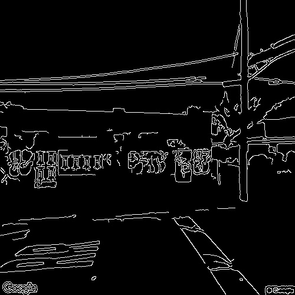
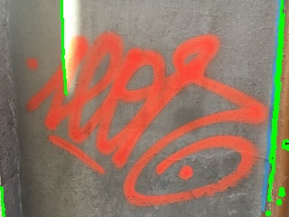

# 🧠 Projeto: Detecção de Grafites Urbanos com Visão Computacional

Este projeto foi desenvolvido como parte da disciplina de **Visão Computacional**, com foco em técnicas de **processamento de imagens** aplicadas à detecção automática de grafites urbanos.

## 📚 Objetivo

Detectar e realçar automaticamente áreas com grafites em imagens urbanas utilizando:

- Pré-processamento com filtros espaciais
- Detecção de bordas
- Contorno das regiões de interesse
- Extração de características (cor e textura) para futuras classificações

## 🗂️ Estrutura de Pastas

<pre lang="markdown"> ``` 
  projeto-visao-computacional-grafite/
├── data/
│ ├── raw/ # Imagens originais
│ └── processed/ # Imagens com pré-processamento (cinza, filtros, bordas)
├── results/ # Imagens com contornos realçados + .csv com características
├── notebooks/
│ └── Projeto Grafite.ipynb
├── utils/
├── .gitignore
└── README.md ``` </pre>

## 🔧 Técnicas aplicadas

- Conversão para escala de cinza
- Filtros espaciais: **Gaussiano** e **Mediano**
- Detectores de borda: **Canny**, **Sobel**, **Laplaciano**
- Detecção e desenho de **contornos**
- Extração de:
  - Cor média (R, G, B)
  - Textura (desvio padrão da imagem)

## 📊 Exemplos de resultados

| Imagem Original | Canny + Gaussiano | Contorno Realçado |
|------------------|-------------------|--------------------|
| .jpg) |  |  |

## 📁 Arquivo CSV

As características extraídas estão em `results/caracteristicas.csv` e podem ser usadas para treinamento de modelos classificadores no futuro.

## 👨‍🎓 Informações

- **Curso**: Inteligência Artificial — FAG
- **Aluno**: Maickel
- **Professor**: Ivan Lourenço Costa
- **Data**: Junho de 2025
