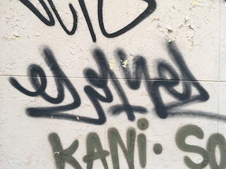
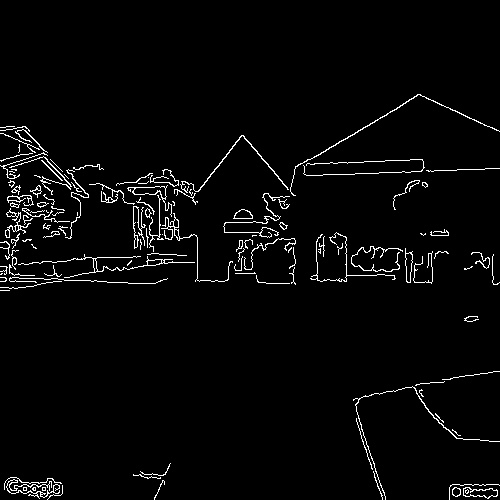
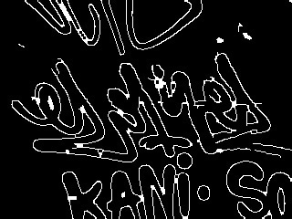
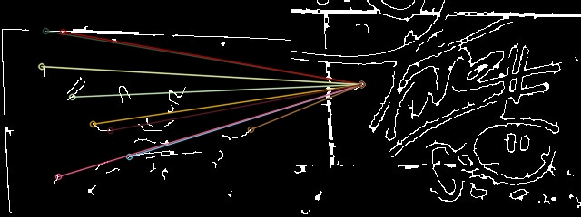

# 🧠 Projeto: Detecção de Grafites Urbanos com Visão Computacional

Este projeto foi desenvolvido como parte da disciplina de **Visão Computacional** (FAG), abordando desde o processamento de imagens até a comparação automática de grafites urbanos em diferentes fotos de rua.

---

## 📚 Objetivo

Desenvolver um sistema capaz de **detectar, realçar e comparar automaticamente áreas com grafites** em imagens urbanas, utilizando:

- Pré-processamento com filtros espaciais
- Detecção e refinamento de bordas
- Operações de morfologia matemática
- Extração de características (cor, textura)
- Correspondência (matching) entre grafites de diferentes imagens

---

## 🗂️ Estrutura de Pastas

<pre lang="markdown"> ``` 
projeto-visao-computacional-grafite/
├── data/
│ ├── raw/ # Imagens originais
│ ├── processed/ # Imagens com pré-processamento (cinza, filtros, bordas)
│ ├── morphology/ # Imagens após operações morfológicas
│ └── matches/ # Resultados das correspondências de características
├── results/ # Imagens finais realçadas e .csv de características
├── notebooks/
│ └── Projeto Grafite.ipynb
├── utils/ # Scripts auxiliares
├── .gitignore
└── README.md  ``` 
</pre>

---

## 🚦 Etapas do Projeto

### **Parte 1: Processamento de Imagens**
- **Conversão para escala de cinza**
- **Filtros espaciais**: Gaussiano, Mediano
- **Detecção de bordas**: Canny, Sobel, Laplaciano
- **Comparação dos resultados** com diferentes filtros e parâmetros
- **Saída**: Imagens pré-processadas em `data/processed/`

### **Parte 2: Morfologia Matemática**
- **Operações morfológicas**: abertura (opening), fechamento (closing)
- **Refino dos contornos** das áreas de grafite para eliminar ruídos e unir linhas quebradas
- **Comparação entre as operações**
- **Saída**: Imagens refinadas em `data/morphology/`

### **Parte 3: Correspondência de Características**
- **Algoritmo ORB** para detecção e descrição de pontos-chave
- **Matching entre diferentes imagens** para encontrar grafites semelhantes
- **Variação e comparação de parâmetros** (número de features, thresholds)
- **Visualização dos melhores pares** e análise dos resultados
- **Saída**: Imagens de matches em `data/matches/`

---

## 🔧 Técnicas aplicadas

- Conversão para escala de cinza
- Filtros espaciais: **Gaussiano** e **Mediano**
- Detectores de borda: **Canny**, **Sobel**, **Laplaciano**
- Operações morfológicas: **Abertura** e **Fechamento**
- Extração de:
  - Cor média (R, G, B)
  - Textura (desvio padrão da imagem)
- Matching de características com **ORB**

---

## 📊 Exemplos de resultados

| Imagem Original | Bordas + Filtros | Morfologia Aplicada | Correspondência (Matching) |
|-----------------|------------------|---------------------|----------------------------|
|  |  |  |  |

---

## 📁 Arquivo CSV

As características extraídas estão em `results/caracteristicas.csv` e podem ser usadas futuramente para treinamento de modelos classificadores.

---

## 👨‍🎓 Informações

- **Curso**: Inteligência Artificial — FAG
- **Aluno**: Maickel
- **Professor**: Ivan Lourenço Costa
- **Data**: Junho de 2025

---

## 💡 Observações

- Todo o código está dividido por etapas em notebooks separados, dentro da pasta `/notebooks`.
- As pastas de saída de cada etapa podem ser adaptadas conforme os experimentos.
- Para viabilizar o projeto computacionalmente, parte das etapas de matching foi feita em subconjuntos representativos das imagens.

---
